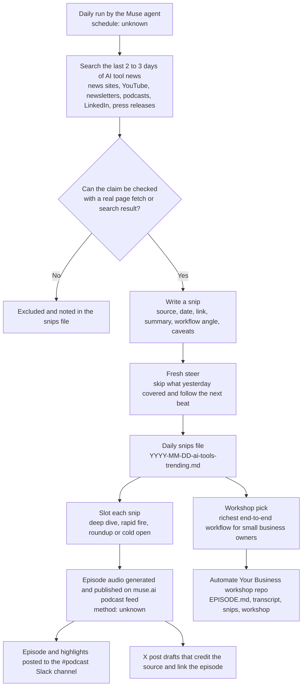

# Soft Fork workflow

This is the flow as far as it can be seen from the files on hand. Steps marked "unknown" are not visible from here.

```mermaid
flowchart TD
    A[Daily run by the Muse agent<br/>schedule: unknown] --> B[Search the last 2 to 3 days of AI tool news<br/>news sites, YouTube, newsletters, podcasts, LinkedIn, press releases]
    B --> C{Can the claim be checked<br/>with a real page fetch or search result?}
    C -- No --> X[Excluded and noted in the snips file]
    C -- Yes --> D[Write a snip<br/>source, date, link, summary, workflow angle, caveats]
    D --> E[Fresh steer<br/>skip what yesterday covered and follow the next beat]
    E --> F[Daily snips file<br/>YYYY-MM-DD-ai-tools-trending.md]
    F --> G[Slot each snip<br/>deep dive, rapid fire, roundup or cold open]
    F --> H[Workshop pick<br/>richest end-to-end workflow for small business owners]
    G --> I[Episode audio generated and published on muse.ai podcast feed<br/>method: unknown]
    I --> J[Episode and highlights posted to the #podcast Slack channel]
    H --> K[Automate Your Business workshop repo<br/>EPISODE.md, transcript, snips, workshop]
    I --> L[X post drafts that credit the source and link the episode]
```
